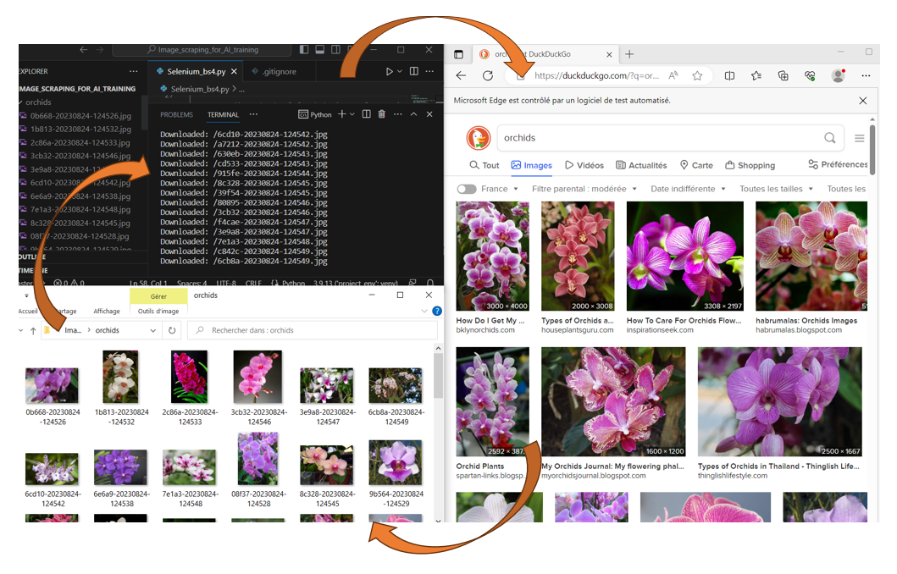

# Image_scraping_for_AI_training

Simple script to scrap Duckduckgo image search to build an images database related to a keyword. 

## Explaination:

* The script invoke a webdriver object from selenium library. 
* The html code of the page is parsed into a beautifulsoup object.
* From the soup object each result images are downloaded. 
* The program iterate to scroll, load more content and continue to download the new images. 
* The program eventually stop when too many empty loops were performed. 

